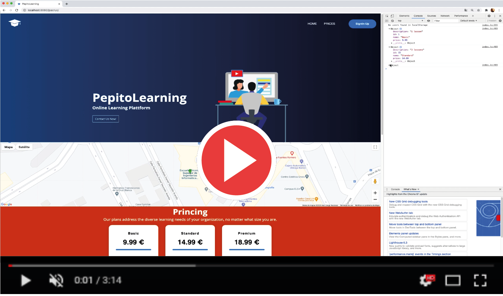

# PepitoLearning 

  

It is an enterprise application for the sale and management of academic courses.

There is an  Android client for this [PepitoLearningAndroid](https://www.github.com/pepitoenpeligro/PepitoLearningAndroid).

## Technologies used
1. Jersey
2. Jaxson
3. Maven
4. Hibernate (Java Persistence Api)
5. Bootstrap for Web Client
6. Docker and docker-compose to containerize the app and facilitate their use in production.

## Demo

## Tributes

It has been developed for the course Design of Software Systems Based on Components and Services (DSSBCS) of the Master in Computer Engineering of the University of Granada in the academic year 2020-2021 by José Antonio Córdoba Gómez ([@pepitoenpeligro](https://www.github.com/pepitoenpeligro))

*PepitoLearning is [@pepitoenpeligro's](https://www.github.com/pepitoenpeligro) idea*